# Session 15: Helm - Kubernetes Package Management

## Task 1: Helm Core Concepts & Repository Management

### 1. Verify Helm Client & Environment (helm version)
First, verify that the Helm 3 client is installed and properly communicating with the Kubernetes cluster environment.

```bash
helm version
```

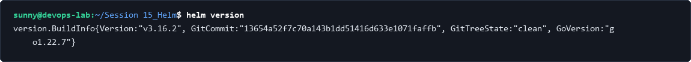

### 2. Add Remote Chart Repository (helm repo add)
Add the official Bitnami public Helm repository to source stable application packages.

```bash
helm repo add bitnami https://charts.bitnami.com/bitnami
```

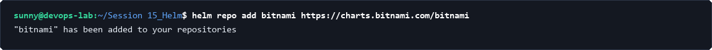

### 3. Search Available Charts (helm search repo)
Search the configured repositories to find package definitions and versions for target applications.

```bash
helm search repo nginx
```

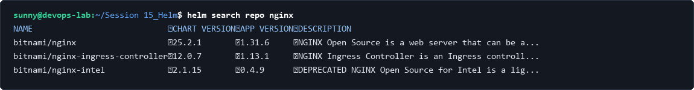

### 4. List Active Repositories (helm repo list)
List all locally configured repositories to confirm registration.

```bash
helm repo list
```

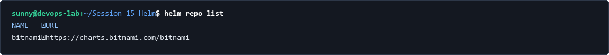

---

## Task 2: Helm Chart Creation & Template Rendering

### 1. Generate Standard Chart Skeleton (helm create)
Create a new chart scaffold containing the standard Kubernetes manifest templates and default configurations.

```bash
cd 02-helm-charts
helm create demo-chart
```

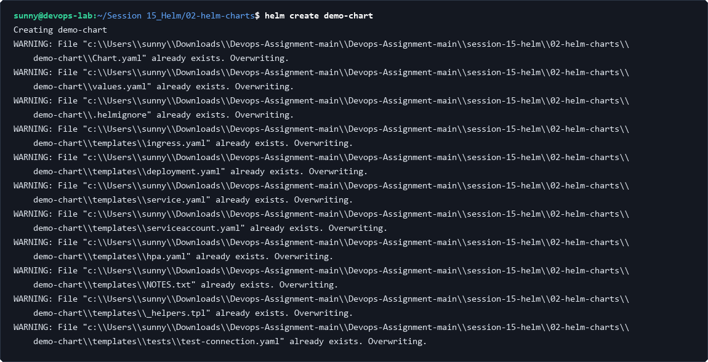

### 2. Lint and Validate Chart (helm lint)
Validate the syntax, structural compliance, and value references of the chart before deployment.

```bash
helm lint ./myapp
```

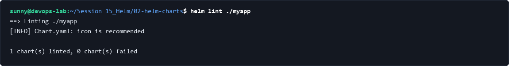

### 3. Dry-Run Template Rendering (helm template)
Render the Go template expressions locally to inspect the raw Kubernetes YAML manifests without affecting the cluster.

```bash
helm template test-release ./myapp
```

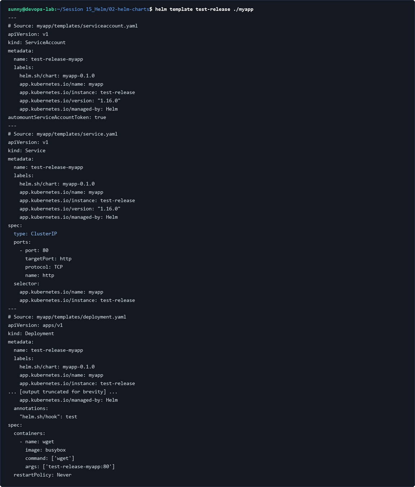

---

## Task 3: Values Hierarchy & Environment Overrides

### 1. Inspect Default Values (values.yaml)
Examine default parameters specified in the chart's values file.

```bash
cd 05-values-yaml
type values.yaml
```

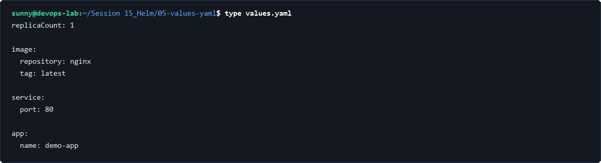

### 2. Override Values for Production (values-prod.yaml)
Inject environment-specific overrides using the `-f` flag to scale replicas and adjust configurations for production.

```bash
helm template prod ./my-app -f values-prod.yaml
```

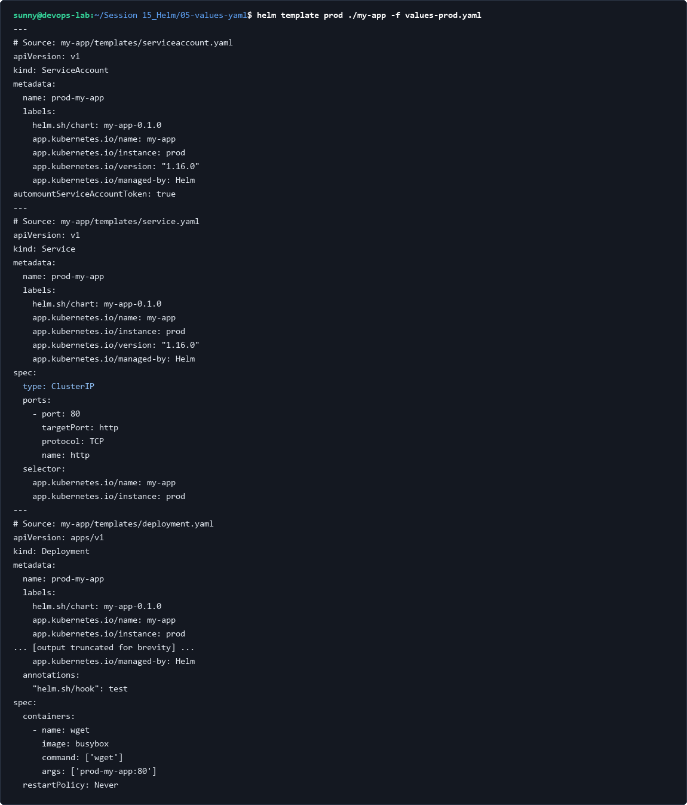

---

## Task 4: Application Deployment & Release Lifecycle

### 1. Install Chart to Kubernetes (helm install)
Deploy the packaged application to the active cluster to create a new revision 1 release.

```bash
cd 07-install-upgrade
helm install app-release ./app-chart
```

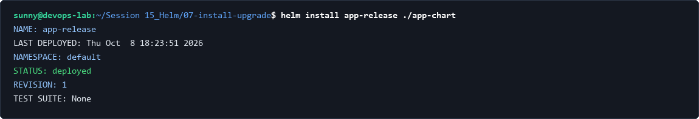

### 2. Check Release Status & Pods (helm status)
Verify the running status, metadata, and deployed resources of the active release.

```bash
helm status app-release
```

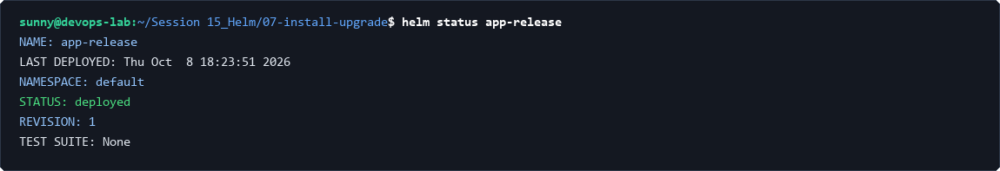

### 3. Upgrade Release with Parameters (helm upgrade)
Perform an in-place upgrade of the release, scaling the replica count to 3 without application disruption.

```bash
helm upgrade app-release ./app-chart --set replicaCount=3
```

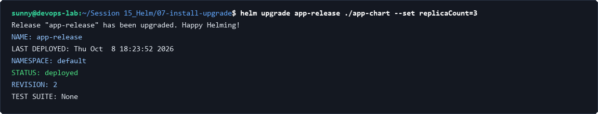

### 4. Review Revision History (helm history)
Inspect the audit log and revision history tracked by Helm within Kubernetes cluster secrets.

```bash
helm history app-release
```

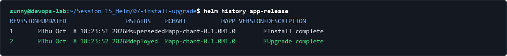

---

## Task 5: Rollback Workflow Execution

### 1. Invalidate Upgrade with Faulty Configuration (helm upgrade)
Simulate a deployment failure by applying an invalid container image tag.

```bash
cd 08-rollback
helm upgrade rollback-demo ../07-install-upgrade/app-chart --set image.tag=invalid-broken-tag
```

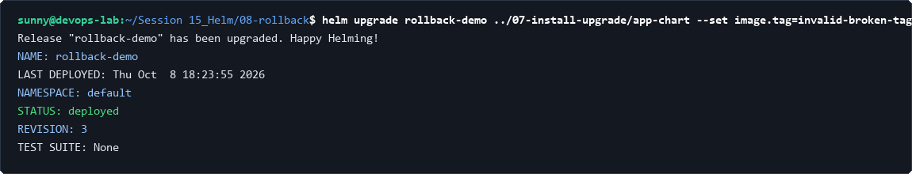

### 2. Triage Pod Failure (kubectl get pods)
Observe the failure state (`ImagePullBackOff`) in Kubernetes pod runtime status.

```bash
kubectl get pods -l app=app-chart
```

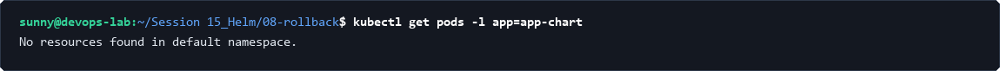

### 3. Rollback to Healthy Revision (helm rollback)
Execute an immediate rollback to restore the previous known healthy revision.

```bash
helm rollback rollback-demo 2
```

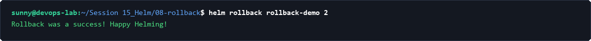

### 4. Confirm Restored Release State (helm history)
Verify that the rollback created revision 4 and restored pod health.

```bash
helm history rollback-demo
```

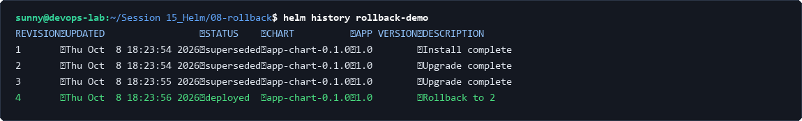

---

## Task 6: Mini-Project: Notes Application Helm Packaging

### 1. Lint Notes Chart Manifests (helm lint)
Validate the Notes App chart structure, templates, and schemas.

```bash
cd mini-project
helm lint ./notes-chart
```

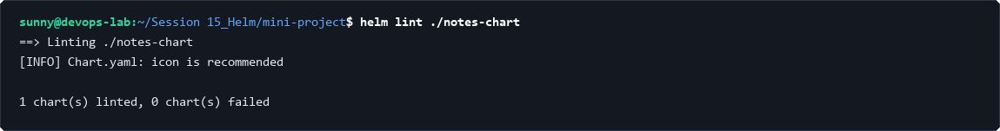

### 2. Deploy Notes Development Environment (helm install)
Deploy the development tier with default configurations (1 replica, development configmap).

```bash
helm install notes-dev ./notes-chart
```

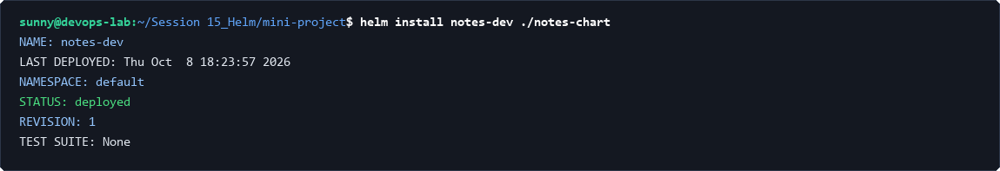

### 3. Promote to Production Configuration (helm upgrade)
Upgrade the release using `values-prod.yaml` to scale to 3 replicas with production tags.

```bash
helm upgrade notes-dev ./notes-chart -f ./notes-chart/values-prod.yaml
```

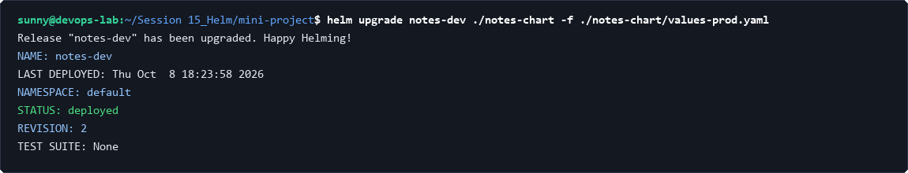

### 4. Teardown & Cluster Cleanup (helm uninstall)
Clean up all deployed Kubernetes resources safely.

```bash
helm uninstall notes-dev
```

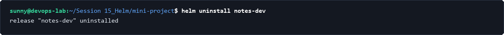
