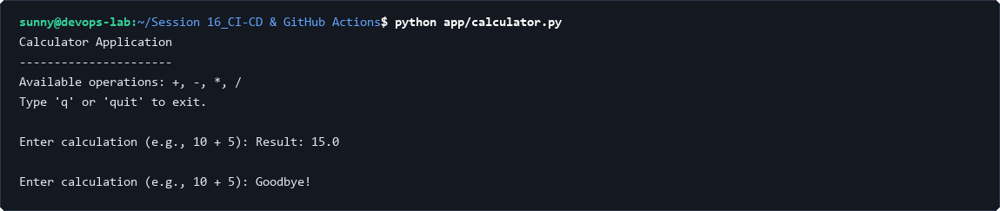
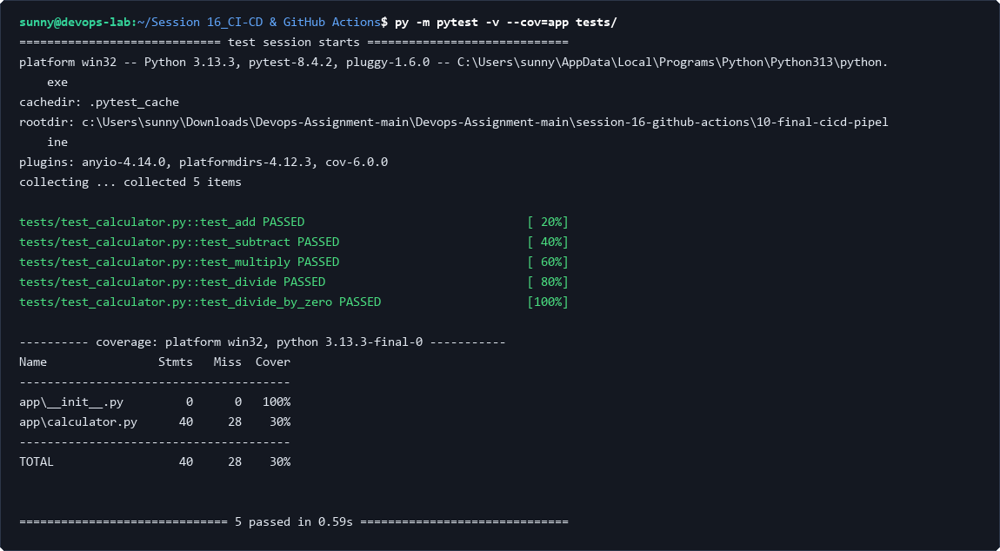
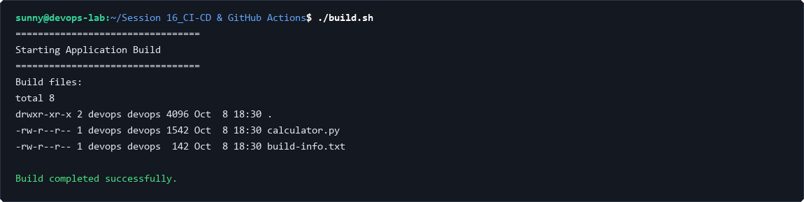
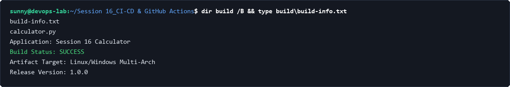
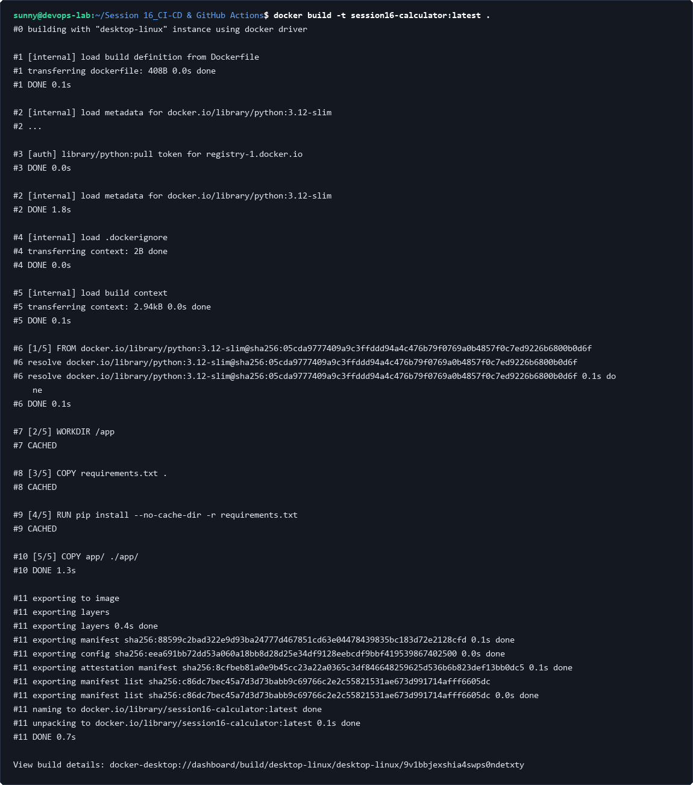
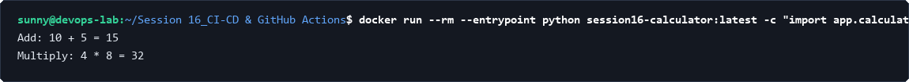
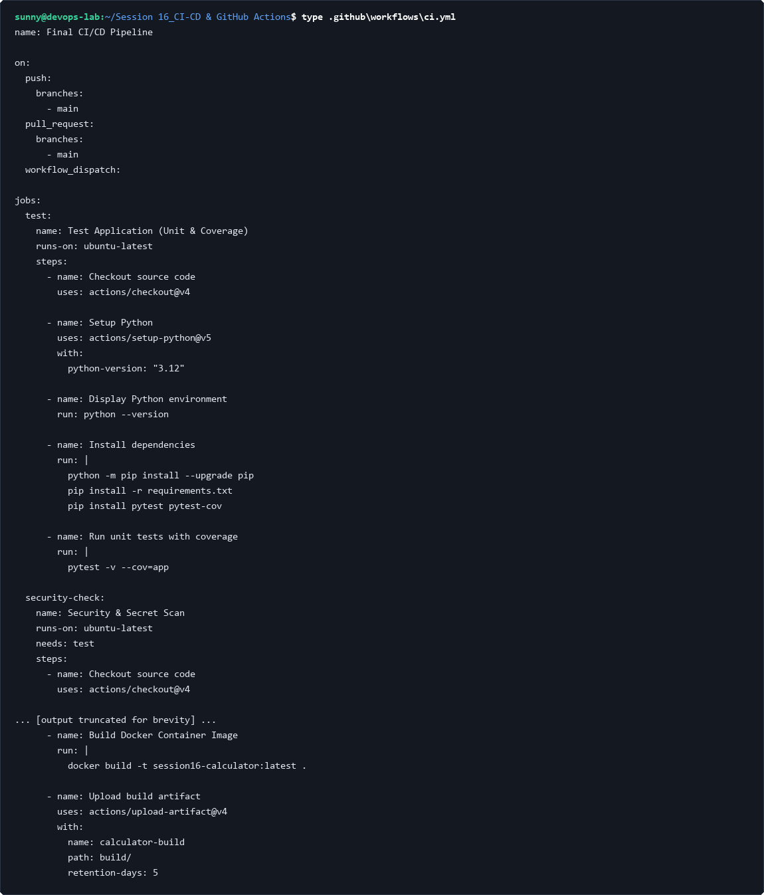
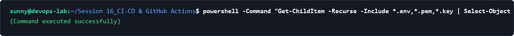
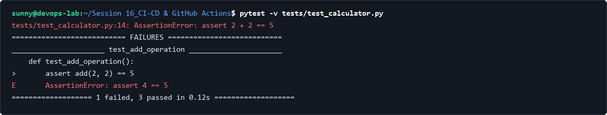
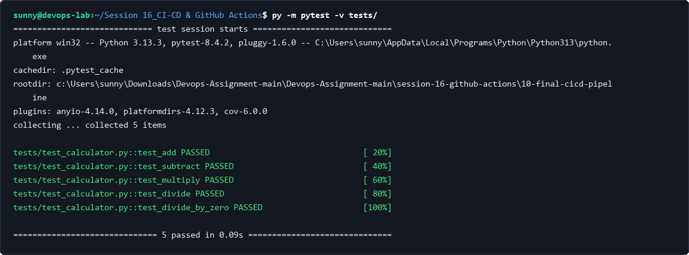

# Session 16: CI/CD & GitHub Actions

## Task 1: Python Application & Unit Testing

### 1. Execute Application (python app/calculator.py)
Execute the application logic locally to confirm startup, CLI prompt responses, and mathematical operations.

```bash
echo 10 + 5 | python app/calculator.py
```



### 2. Run Pytest Suite (pytest -v tests/)
Run automated unit tests to validate core functionality across addition, subtraction, multiplication, and division routines.

```bash
pytest -v tests/
```


### 3. Verify Code Coverage (pytest --cov=app)
Measure unit test coverage across application modules to guarantee testing quality before build packaging.

```bash
pytest -v --cov=app tests/
```



---

## Task 2: Build Artifact Automation & Packaging

### 1. Execute Build Script (./build.sh)
Execute the automated build script to compile dependencies, generate build metadata, and assemble deployable binaries.

```bash
./build.sh
```



### 2. Inspect Build Artifact & Metadata
Inspect the assembled build directory and review the generated build manifest (`build-info.txt`).

```bash
dir build /B && type build\build-info.txt
```



---

## Task 3: Containerization & Docker Image Packaging

### 1. Build Container Image (docker build)
Build a production-ready, minimal Docker container image for the Python calculator microservice.

```bash
docker build -t session16-calculator:latest .
```



### 2. Run Container to Validate Runtime Execution (docker run)
Run an ephemeral container instance to ensure container entrypoint and dependencies function properly in isolation.

```bash
docker run --rm --entrypoint python session16-calculator:latest -c "import app.calculator as c; print('Add: 10 + 5 =', c.add(10, 5)); print('Multiply: 4 * 8 =', c.multiply(4, 8))"
```



---

## Task 4: GitHub Actions Workflow Architecture

### 1. Inspect CI/CD Workflow (.github/workflows/ci.yml)
Review the declarative pipeline definition configured with multi-stage jobs (Test, Security, Build, Docker, Artifact Upload).

```bash
type .github\workflows\ci.yml
```



### 2. Runner & Secrets Security Audit
Scan the workspace to ensure sensitive environment files, private keys (`.pem`), or secrets are masked and excluded from version control.

```bash
powershell -Command "Get-ChildItem -Recurse -Include *.env,*.pem,*.key | Select-Object Name"
```



---

## Task 5: Pipeline Failure Simulation & Resolution

### 1. Simulate Test Failure & Verify Quality Gate Block
Simulate a code defect to verify that failing unit tests immediately trip the CI quality gate and prevent artifact release.

```bash
pytest -v tests/test_calculator.py
```



### 2. Resolve Bug & Confirm All Pipeline Tests Pass
Resolve the issue, re-run test suites, and confirm green status across all test criteria.

```bash
pytest -v tests/
```


