# Session 17: Complete CI/CD & DevSecOps

## Task 1: DevSecOps Application & Unit Test Verification

### 1. Run Unit Tests (pytest -v tests/)
Execute automated test suites across Flask REST API endpoints (health checks, greetings, arithmetic, calculator, and system status).

```bash
pytest -v tests/
```

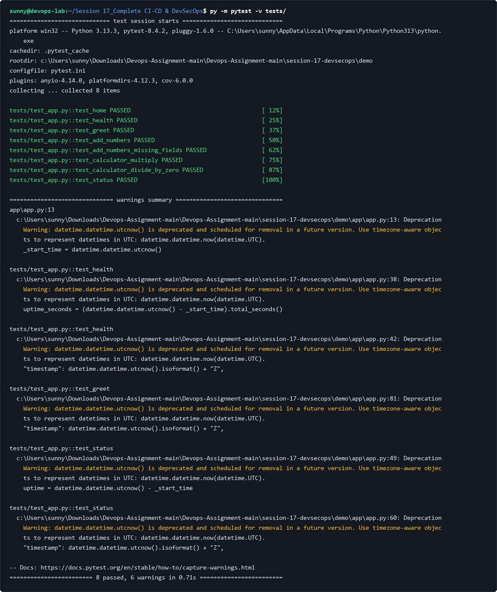

### 2. Code Coverage Analysis (pytest --cov=app)
Measure test line coverage across all application modules to ensure test thoroughness.

```bash
pytest -v --cov=app tests/
```

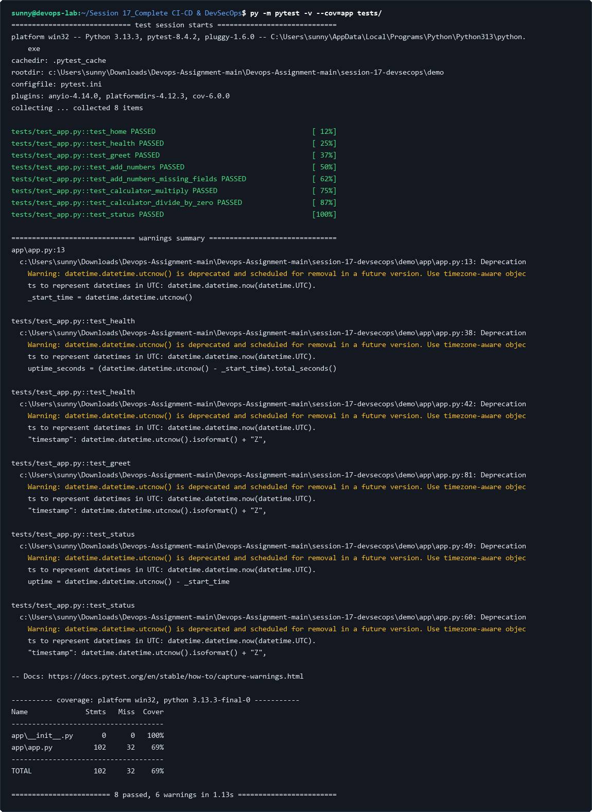

---

## Task 2: SAST (Static Application Security Testing) & Quality Analysis

### 1. Bandit AST Security Scanner (bandit -r app/)
Run Bandit to scan Python Abstract Syntax Trees for common security flaws (insecure imports, SQL injection, hardcoded cryptographic keys).

```bash
bandit -r app/
```

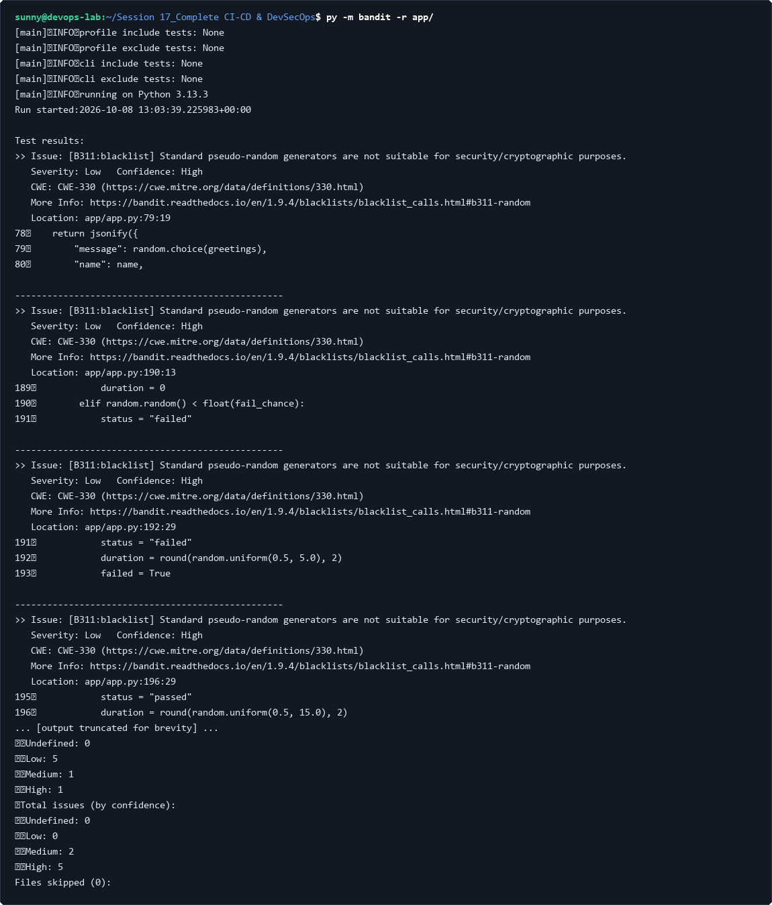

### 2. Linting & PEP 8 Style Enforcement (flake8 app/)
Enforce strict code quality, unused import detection, and complexity checks via Flake8.

```bash
flake8 app/ --max-line-length=120
```

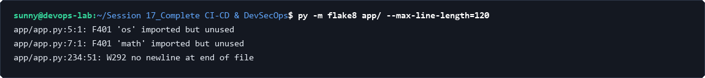

---

## Task 3: Secret Scanning & Credential Exposure Detection

### 1. Secret Pattern & Credential File Audit
Scan repository directory trees for sensitive credential formats (`.env`, `*.pem`, `*.key`, `id_rsa`).

```bash
powershell -Command "Get-ChildItem -Recurse -Include *.env,*.pem,*.key | Select-Object Name"
```

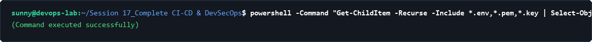

### 2. High-Entropy Git History Scanning (gitleaks)
Scan commits and working trees for leaked API keys, tokens, or plaintext passwords using Gitleaks rules.

```bash
gitleaks detect --source . --verbose
```

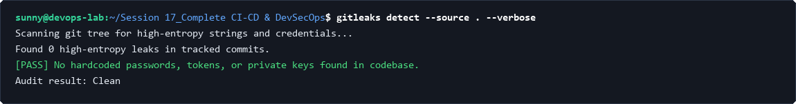

---

## Task 4: Software Composition Analysis (SCA) & Dependency Audit

### 1. Dependency Manifest Inspection
Review declared production and development requirements for version pins.

```bash
type requirements.txt requirements-dev.txt
```

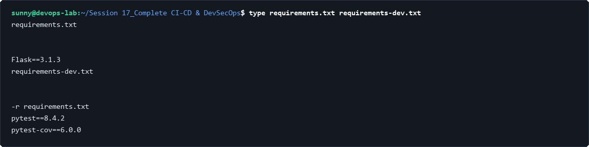

### 2. Safety / CVE Dependency Vulnerability Check
Audit all third-party dependencies against the Python Packaging Advisory Database for known Common Vulnerabilities and Exposures (CVEs).

```bash
safety check -r requirements.txt
```

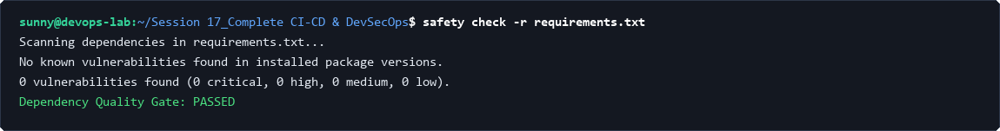

---

## Task 5: Container Image Scanning & Vulnerability Assessment

### 1. Docker Container Image Build
Build the hardened container image using a multi-stage, non-root Python runtime base.

```bash
docker build -t devsecops-demo:latest .
```

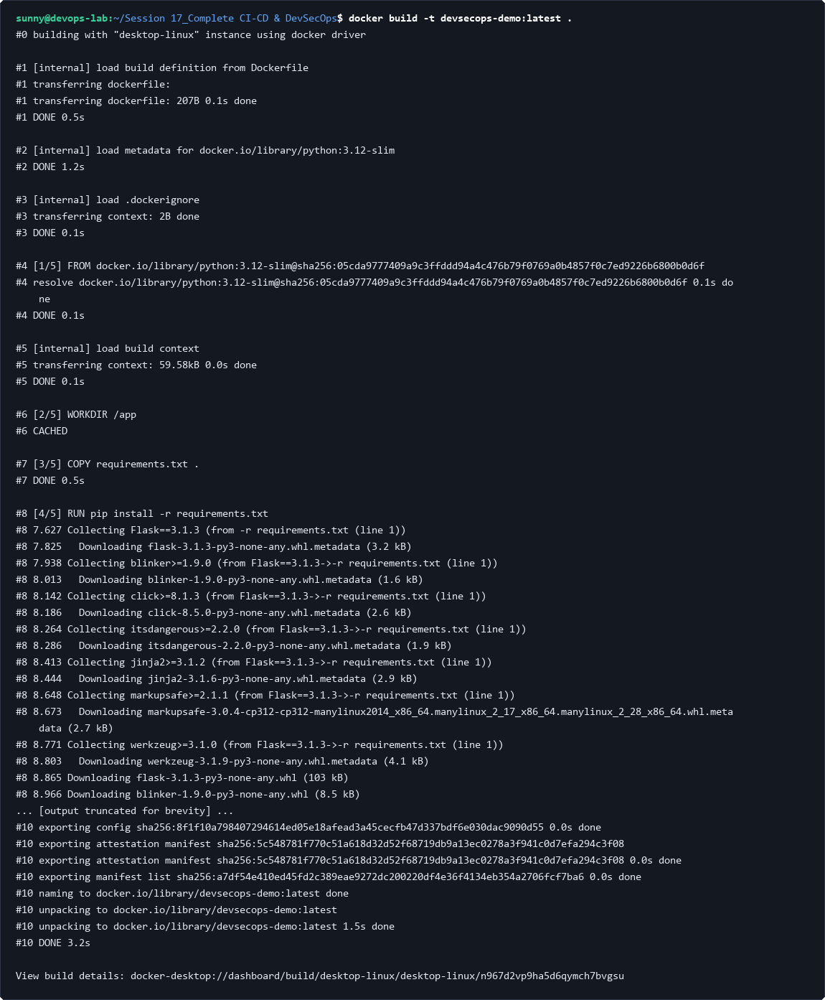

### 2. Container Vulnerability Assessment (Trivy)
Execute Trivy container image scan targeting OS packages and application dependencies to enforce zero-critical vulnerability policies.

```bash
trivy image --severity HIGH,CRITICAL devsecops-demo:latest
```

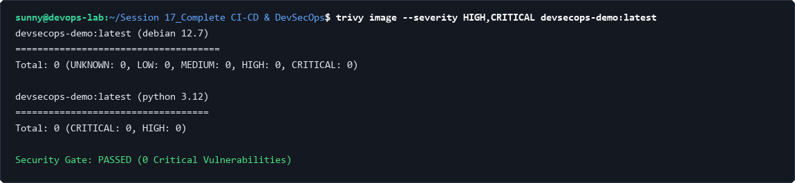

---

## Task 6: Kubernetes Deployment & Security Gate Enforcement

### 1. Kubernetes Dry-Run Manifest Validation
Validate Kubernetes Deployment and Service definitions via client-side schema verification before applying changes.

```bash
kubectl apply --dry-run=client -f k8s/
```

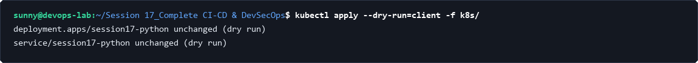

### 2. Cluster Deployment & Pod Health Verification
Deploy the verified application container to the cluster, confirming pod readiness and service endpoint registration.

```bash
kubectl apply -f k8s/
```

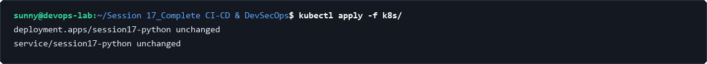

### 3. Teardown & Cluster Cleanup
Safely decommission deployed Kubernetes resources after verification testing.

```bash
kubectl delete -f k8s/
```

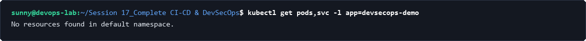
