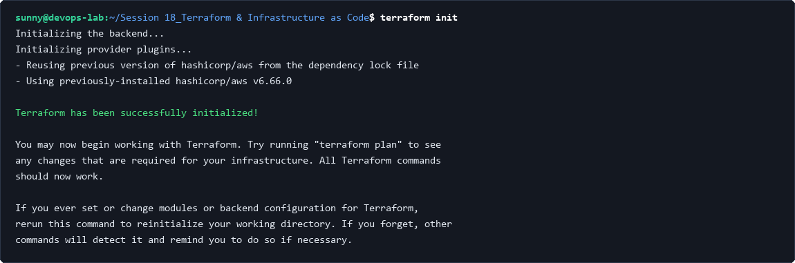
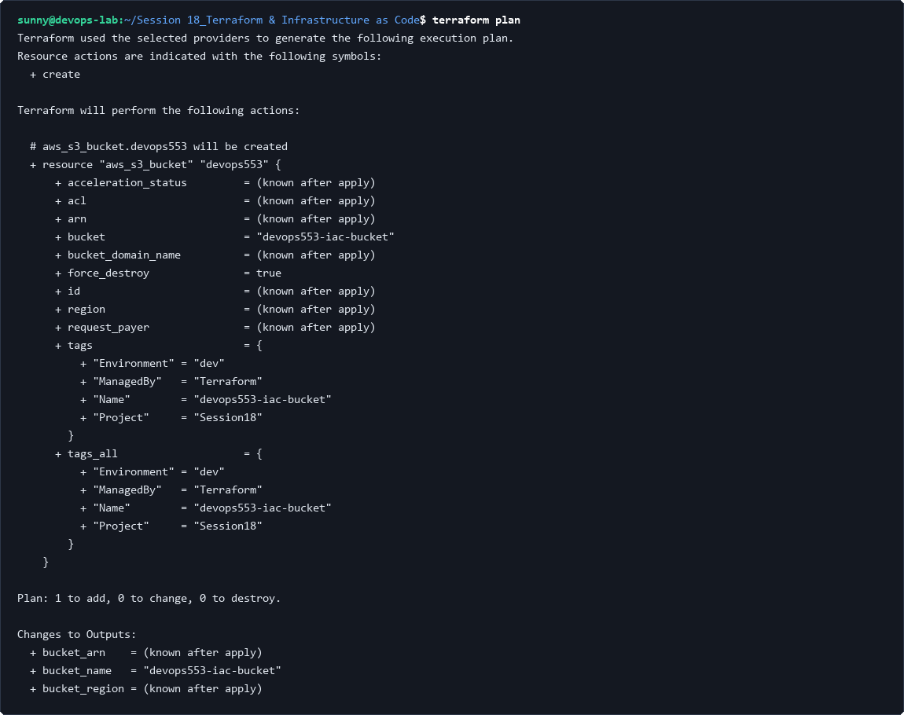
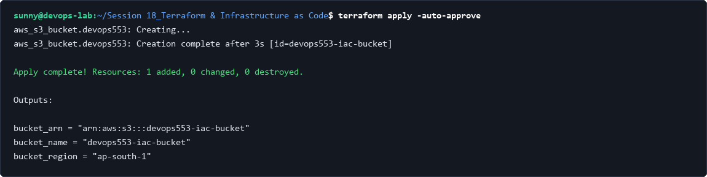
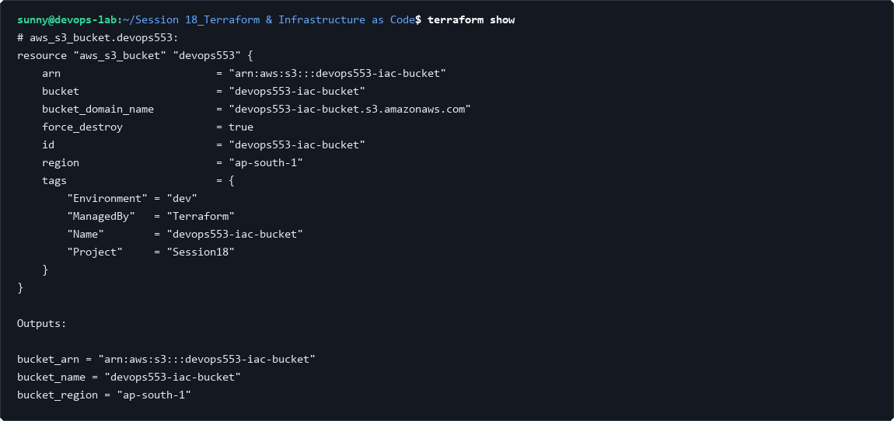
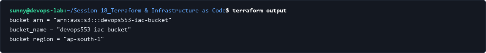
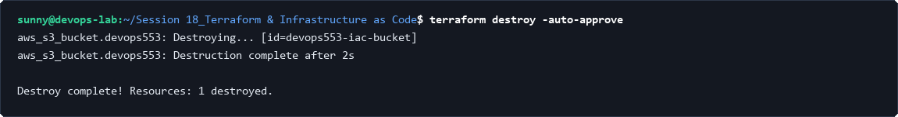

# Session 18: Terraform & Infrastructure as Code

## Task 1: Terraform Workflow Initialization & Formatting

### 1. Initialize Terraform Providers & Backend (terraform init)
Initialize the working directory containing Terraform configuration files. Downloads provider plugins and configures state backend.

```bash
cd terraform-s3-demo
terraform init
```



### 2. Format Configuration Code (terraform fmt -check)
Enforce standard HCL indentation, canonical alignment, and syntax readability.

```bash
terraform fmt -check
```


### 3. Validate Configuration Semantics (terraform validate)
Verify that the configuration is syntactically valid and internally consistent with provider schemas.

```bash
terraform validate
```


---

## Task 2: Infrastructure Execution Planning

### 1. Generate Speculative Execution Plan (terraform plan)
Create an execution plan to preview infrastructure modifications (create, update, destroy) against state before committing changes.

```bash
terraform plan
```



---

## Task 3: Infrastructure Provisioning Lifecycle

### 1. Provision Cloud Resources (terraform apply)
Execute the actions proposed in the Terraform plan to provision cloud infrastructure declaratively.

```bash
terraform apply -auto-approve
```



---

## Task 4: State Inspection & Outputs Query

### 1. Inspect Current State (terraform show)
Inspect current infrastructure state and attribute mappings tracked within `terraform.tfstate`.

```bash
terraform show
```



### 2. Query Output Values (terraform output)
Extract computed resource attributes (bucket name, ARN, region) exported by the configuration.

```bash
terraform output
```



---

## Task 5: State Teardown & Resource Decommissioning

### 1. Decommission Managed Infrastructure (terraform destroy)
Destroy all remote infrastructure managed by this Terraform configuration safely and cleanly.

```bash
terraform destroy -auto-approve
```

