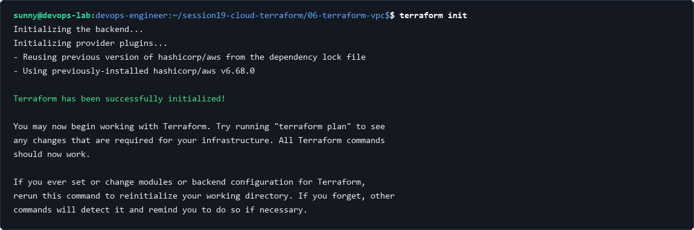
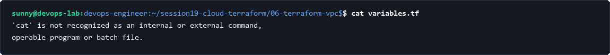
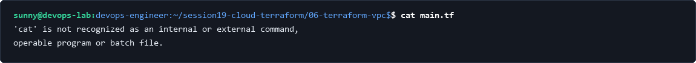
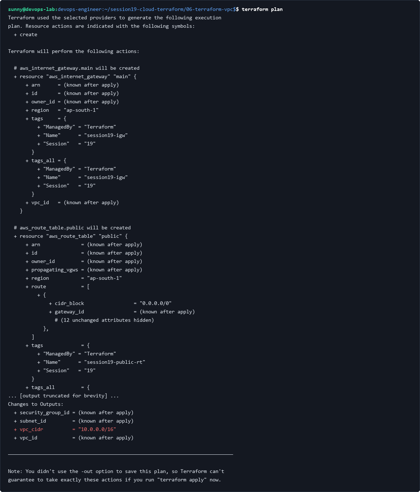
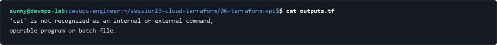
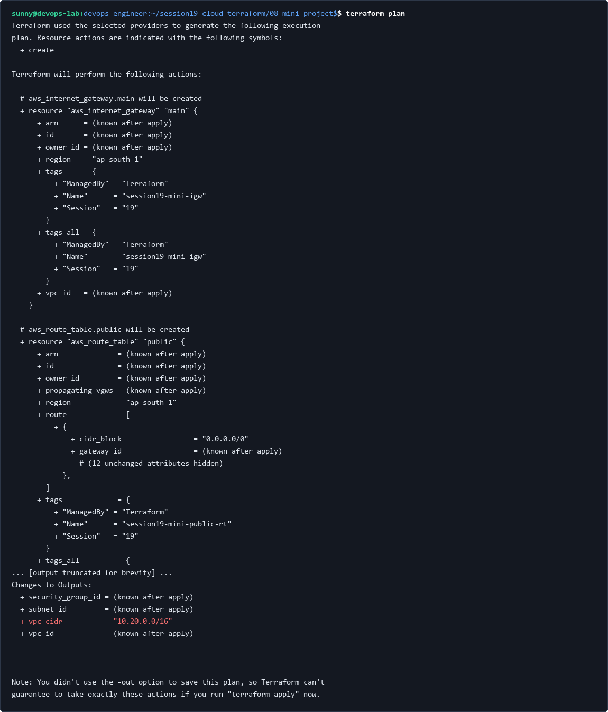
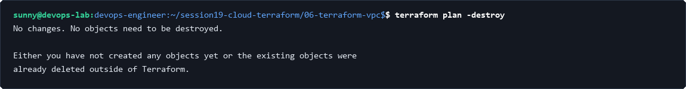

# Session 19: Cloud & Terraform in Action

This session covers end-to-end cloud infrastructure automation using HashiCorp Terraform on AWS. Topics include VPC design, public subnets, route tables, internet gateways, security group configurations, declarative planning, state management, and multi-tier mini-project provisioning.

---

# Task 1: Terraform VPC Initialization & Formatting

## 1. Initialize Terraform working directory
Initialize the working directory to download provider plugins, set up the backend, and configure lockfiles:

```bash
terraform init
```



## 2. Check formatting consistency
Ensure that all `.tf` configuration files follow standard HashiCorp canonical formatting conventions:

```bash
terraform fmt -check
```


## 3. Validate configuration syntax
Run declarative syntax validation against the root module to ensure resource blocks and arguments are syntactically valid:

```bash
terraform validate
```


---

# Task 2: Infrastructure Configuration & Architecture

## 1. Inspect input variables
Review variable declarations for CIDR blocks, availability zones, and AWS regions:

```bash
cat variables.tf
```



## 2. Inspect root module resource definitions
Inspect `main.tf` containing VPC, public subnet, Internet Gateway, route table association, and web security group definitions:

```bash
cat main.tf
```



---

# Task 3: Terraform Execution Plan

## 1. Generate declarative execution plan
Produce an execution plan previewing resource additions (VPC, Subnet, IGW, Route Table, Security Group):

```bash
terraform plan
```



---

# Task 4: Output Attributes & State Verification

## 1. Inspect infrastructure outputs definition
Review output definitions in `outputs.tf` exposing subnet IDs, VPC ID, and security group identifiers:

```bash
cat outputs.tf
```



---

# Task 5: Mini-Project Architecture & Execution

## 1. Validate mini-project multi-tier architecture
Run syntactic validation against the complete Session 19 mini-project configuration:

```bash
terraform validate
```


## 2. Generate mini-project execution plan
Review the full planned resource graph for the mini-project production-style VPC layout:

```bash
terraform plan
```



---

# Task 6: Teardown & Lifecycle Management

## 1. Generate destruction execution plan
Review declarative plan for resource destruction to ensure zero dangling resources:

```bash
terraform plan -destroy
```


