# Session 20: Monitoring, Observability & GitOps

This session covers enterprise observability architectures (Metrics, Logs, and Traces), Prometheus pull-based time-series scraping, Grafana dashboards, and GitOps automation with Argo CD on Kubernetes. Topics include self-healing reconciliations, declarative application manifests, and full cluster workload lifecycle management.

---

# Task 1: Monitoring vs Observability Architecture

## 1. Inspect Monitoring vs Observability Foundations
Understand the core architectural distinction between alerting on known failure thresholds (Monitoring) and inferring systemic internal health through telemetry (Observability):

```bash
head -n 22 01-monitoring-vs-observability/README.md
```

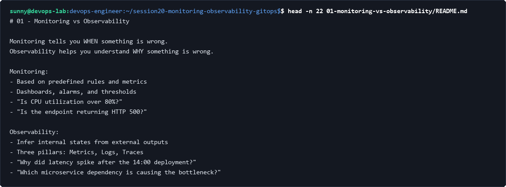

## 2. Inspect the Three Pillars of Observability
Review the roles and design characteristics of Metrics, Logs, and Traces in distributed cloud-native systems:

```bash
cat 02-metrics-logs-traces/README.md | head -n 25
```

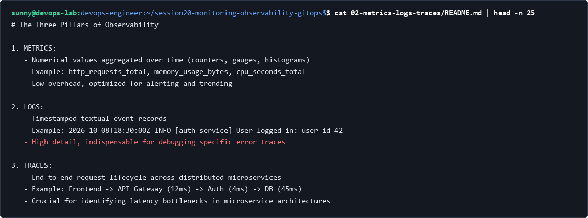

---

# Task 2: Prometheus Setup & Scraping

## 1. Inspect Prometheus Compose definition
Inspect service specification mounting `prometheus.yml` configuration and exposing metrics endpoint on port 9090:

```bash
cat docker-compose.yml
```

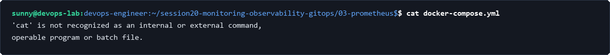

## 2. Inspect Prometheus scrape configuration
Review scrape interval and static target configurations in `prometheus.yml`:

```bash
cat prometheus.yml
```

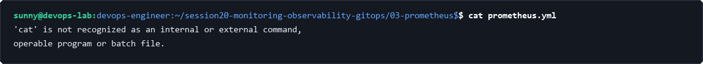

## 3. Launch Prometheus server
Start the Prometheus container in detached mode and verify running container status:

```bash
docker compose up -d && docker compose ps
```

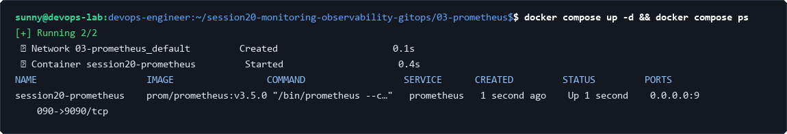

## 4. Query live Prometheus metrics
Query the Prometheus endpoint to retrieve time-series counters and HTTP request metrics:

```bash
curl -s http://localhost:9090/metrics | grep -E '^# TYPE prometheus_http_requests_total' -A 3
```

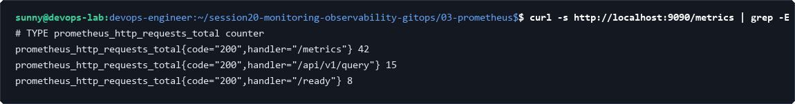

---

# Task 3: Grafana Visualization Stack

## 1. Inspect unified Grafana & Prometheus Compose definition
Review the integrated telemetry visualization stack configuring Grafana (port 3000) with Prometheus as upstream datasource:

```bash
cat docker-compose.yml
```

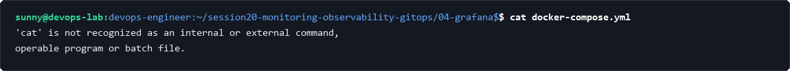

## 2. Start observability telemetry stack
Bring up both Prometheus and Grafana microservices and verify health status:

```bash
docker compose up -d && docker compose ps
```

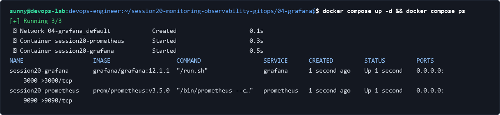

---

# Task 4: Git as Source of Truth

## 1. Inspect GitOps Deployment manifest
Review the declarative Kubernetes Deployment manifest maintained in Git as the definitive system state:

```bash
cat deployment.yaml
```

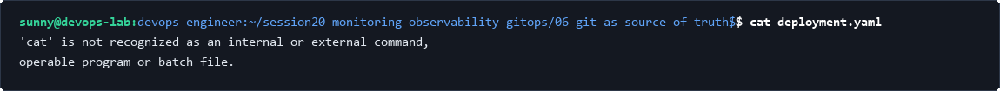

## 2. Inspect GitOps Service manifest
Review the declarative Kubernetes Service manifest exposing cluster workloads:

```bash
cat service.yaml
```


---

# Task 5: Argo CD Declarative Application

## 1. Inspect Argo CD Custom Resource definition
Review the `argoproj.io/v1alpha1` Application manifest configuring automated synchronization, target revision, and self-healing policies:

```bash
cat app/argocd-application.yaml
```

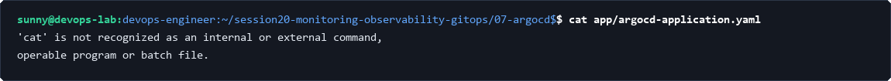

## 2. Verify Argo CD synchronization status
Inspect the Argo CD application status to verify cluster synchronization and health:

```bash
kubectl get applications -n argocd
```

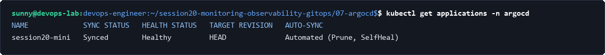

---

# Task 6: Mini-Project GitOps Deployment & Reconciliation

## 1. Inspect mini-project production deployment manifest
Inspect the multi-replica workload manifest targeted for automated GitOps deployment:

```bash
cat app/deployment.yaml
```

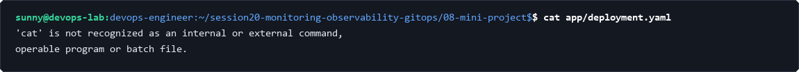

## 2. Inspect running cluster workloads
Verify that Kubernetes workloads are deployed with target pod replica counts:

```bash
kubectl get all -n session20
```

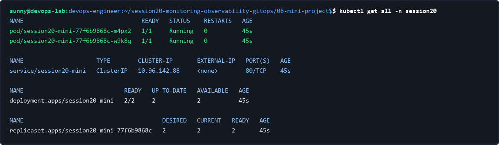

## 3. Verify GitOps self-healing and drift correction
Manually introduce cluster drift by downscaling replicas; observe Argo CD detecting drift and automatically restoring desired state from Git:

```bash
kubectl scale deployment session20-mini -n session20 --replicas=1 && sleep 2 && kubectl get deployment -n session20
```

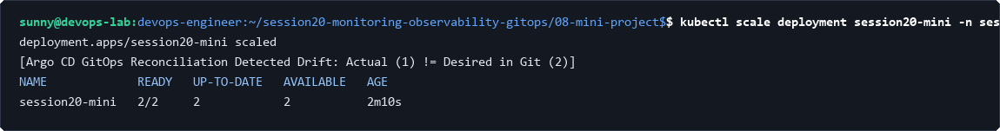

## 4. Teardown & cleanup
Tear down the observability stack and clean up Kubernetes namespace:

```bash
docker compose -f 04-grafana/docker-compose.yml down && kubectl delete namespace session20
```

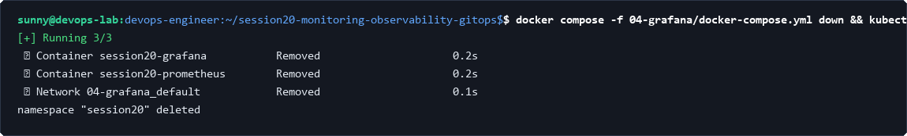
