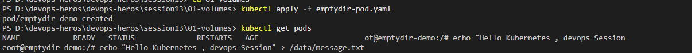
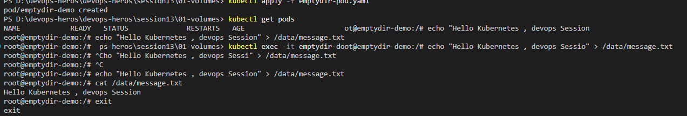
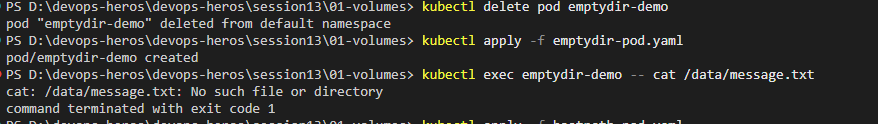
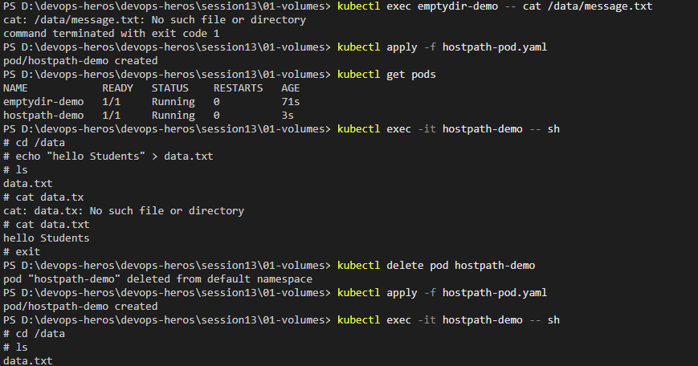

# Kubernetes Volumes

## What will we learn?

* What is a Kubernetes Volume?
* Why do containers need volumes?
* What is `emptyDir`?
* How does storage behave when a container or Pod restarts?
* Basic idea of `hostPath`

---

## 1. Why Do We Need Volumes?

Normally, data written inside a container belongs to the container's filesystem.

If the container is removed, that data can be lost.

A volume gives the container another place to store data.

### Simple idea:

```text
Container
    │
    │ writes data
    ▼
 Volume
```

---

## 2. `emptyDir`

`emptyDir` creates an empty directory when the Pod starts.

The containers inside the same Pod can use it.

### Example structure:

```text
Pod
 │
 ├── Container
 │
 └── emptyDir
       │
       └── /data
```

### The important point:

* `emptyDir` exists as long as the Pod exists.
* If the Pod is deleted and recreated, the old `emptyDir` data is gone.

---

## 3. Run `emptyDir` Example

Apply the YAML:

```bash
kubectl apply -f emptydir-pod.yaml
```

Check the Pod:

```bash
kubectl get pods
```

Expected output:

```text
NAME            READY   STATUS    RESTARTS   AGE
emptydir-demo   1/1     Running   0          10s
```



---

## 4. Create a File

Enter the container:

```bash
kubectl exec -it emptydir-demo -- bash
```

Inside the container, create a file:

```bash
echo "Hello Kubernetes" > /data/message.txt
```

Read it:

```bash
cat /data/message.txt
```

Output:

```text
Hello Kubernetes
```

Exit:

```bash
exit
```

---

## 5. Delete the Pod

Delete the running Pod:

```bash
kubectl delete pod emptydir-demo
```

Create it again:

```bash
kubectl apply -f emptydir-pod.yaml
```

Try reading the old file:

```bash
kubectl exec emptydir-demo -- cat /data/message.txt
```

Output:

```text
cat: /data/message.txt: No such file or directory
```

You should get an error because the old Pod and its `emptyDir` storage were deleted.

---


## 6. `hostPath`

`hostPath` mounts a directory from the Kubernetes node into the Pod.

### Example snippet:

```yaml
volumes:
  - name: storage
    hostPath:
      path: /tmp/student-data
```


The Pod can access that directory.

### Important:

`hostPath` is mainly useful for:

* Learning
* Local testing
* Special node-level use cases

It is generally not the first choice for persistent application storage in a production cluster.

---

## Useful Commands

```bash
kubectl get pods
kubectl describe pod emptydir-demo
kubectl exec -it emptydir-demo -- bash
kubectl delete pod emptydir-demo
```

---

## Key Learning

Remember:

```text
Volume
   │
   └── gives storage to containers

emptyDir
   │
   ├── temporary storage
   └── lifetime is linked to the Pod
```

---

## Reference

* **Kubernetes Volumes:**  
  https://kubernetes.io/docs/concepts/storage/volumes/


```
PS D:\devops-heros\devops-heros\session13> kubectl apply -f emptydir-pod.yaml
error: the path "emptydir-pod.yaml" does not exist
PS D:\devops-heros\devops-heros\session13> dir


    Directory: D:\devops-heros\devops-heros\session13


Mode                 LastWriteTime         Length Name                                                                                                                                                
----                 -------------         ------ ----                                                                                                                                                
d-----         9/19/2026  10:15 AM                01-volumes                                                                                                                                          
d-----         9/19/2026  10:15 AM                02-persistent-storage                                                                                                                               
d-----         9/19/2026  10:15 AM                03-storageclass                                                                                                                                     
d-----         9/19/2026  10:15 AM                04-hpa                                                                                                                                              
d-----         9/19/2026  10:15 AM                05-probes                                                                                                                                           
d-----         9/19/2026  10:15 AM                hpa                                                                                                                                                 
d-----         9/19/2026  10:15 AM                mini-project                                                                                                                                        


PS D:\devops-heros\devops-heros\session13> cd 01-volumes
PS D:\devops-heros\devops-heros\session13\01-volumes> kubectl apply -f emptydir-pod.yaml
pod/emptydir-demo created
PS D:\devops-heros\devops-heros\session13\01-volumes> kubectl get pods
NAME            READY   STATUS              RESTARTS   AGE                        ot@emptydir-demo:/# echo "Hello Kubernetes , devops Session
eoot@emptydir-demo:/# echo "Hello Kubernetes , devops Session" > /data/message.txt
root@emptydir-demo:/#  ps-heros\session13\01-volumes> kubectl exec -it emptydir-doot@emptydir-demo:/# echo "Hello Kubernetes , devops Sessio" > /data/message.txt
root@emptydir-demo:/# ^Cho "Hello Kubernetes , devops Sessi" > /data/message.txt 
root@emptydir-demo:/# ^C
root@emptydir-demo:/# echo "Hello Kubernetes , devops Session" > /data/message.txt
root@emptydir-demo:/# cat /data/message.txt
Hello Kubernetes , devops Session
root@emptydir-demo:/# exit
exit
PS D:\devops-heros\devops-heros\session13\01-volumes> kubectl delete pod emptydir-demo
pod "emptydir-demo" deleted from default namespace
PS D:\devops-heros\devops-heros\session13\01-volumes> kubectl apply -f emptydir-pod.yaml
pod/emptydir-demo created
PS D:\devops-heros\devops-heros\session13\01-volumes> kubectl exec emptydir-demo -- cat /data/message.txt
cat: /data/message.txt: No such file or directory
command terminated with exit code 1
PS D:\devops-heros\devops-heros\session13\01-volumes> kubectl apply -f hostpath-pod.yaml
pod/hostpath-demo created
PS D:\devops-heros\devops-heros\session13\01-volumes> kubectl get pods
NAME            READY   STATUS    RESTARTS   AGE
emptydir-demo   1/1     Running   0          71s
hostpath-demo   1/1     Running   0          3s
PS D:\devops-heros\devops-heros\session13\01-volumes> kubectl exec -it hostpath-demo -- sh
# cd /data                              
# echo "hello Students" > data.txt
# ls 
data.txt
# cat data.tx
cat: data.tx: No such file or directory
# cat data.txt
hello Students
# exit
PS D:\devops-heros\devops-heros\session13\01-volumes> kubectl delete pod hostpath-demo
pod "hostpath-demo" deleted from default namespace
PS D:\devops-heros\devops-heros\session13\01-volumes> kubectl apply -f hostpath-pod.yaml
pod/hostpath-demo created
PS D:\devops-heros\devops-heros\session13\01-volumes> kubectl exec -it hostpath-demo -- sh
# cd /data
# ls     
data.txt
# cat data.txt
hello Students
# exit
```