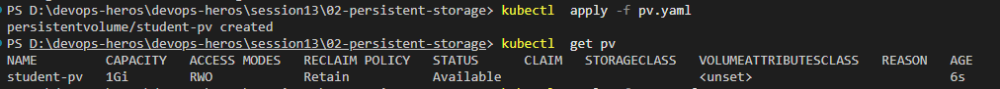
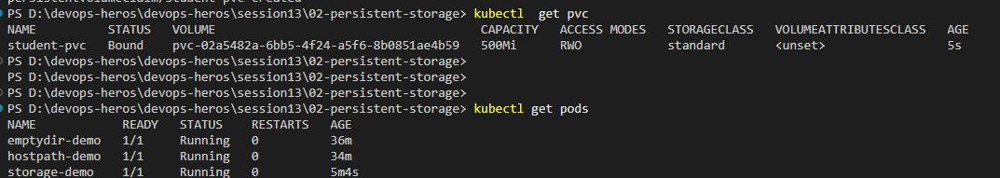
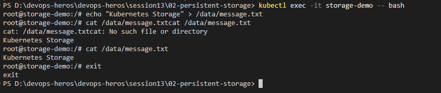
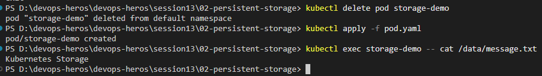

# Kubernetes Persistent Storage


## What will we work with?

* PersistentVolume (`PV`)
* PersistentVolumeClaim (`PVC`)
* Pod
* Persistent storage

---

## 1. The Problem

Suppose our application stores:

* `student-data.txt`
* `database-data`
* `images`
* `logs`

inside a Pod.

If the Pod is deleted, we don't want our important data to disappear.

For this, Kubernetes provides persistent storage.

---

## 2. PersistentVolume

A PersistentVolume is a storage resource available to the Kubernetes cluster.

Think of it like:

> **PV = Storage available in the cluster**

Our example creates:

* Capacity: `1Gi`
* Access Mode: `ReadWriteOnce`

Check the PV:

```bash
kubectl get pv
```

---

## 3. PersistentVolumeClaim

A PersistentVolumeClaim is a request for storage.

Think of it like:

```text
PV
 │
 │ provides storage
 ▼
PVC
 │
 │ requests storage
 ▼
Pod
```

Our PVC requests:

* Capacity: `500Mi`
* Access Mode: `ReadWriteOnce`

---

## 4. Create the PV

Run:

```bash
kubectl apply -f pv.yaml
```

Check:

```bash
kubectl get pv
```

Expected output:

```text
NAME         CAPACITY   ACCESS MODES   RECLAIM POLICY   STATUS
student-pv   1Gi        RWO            Retain           Available
```

---

## 5. Create the PVC

Run:

```bash
kubectl apply -f pvc.yaml
```

Check:

```bash
kubectl get pvc
```

Expected output:

```text
NAME          STATUS   VOLUME
student-pvc   Bound    student-pv
```

**Bound** means the PVC has been connected to a suitable PV.

---

## 6. Create the Pod

Run:

```bash
kubectl apply -f pod.yaml
```

Check:

```bash
kubectl get pods
```

Expected output:

```text
NAME            READY   STATUS
storage-demo    1/1     Running
```

---

## 7. Test Persistent Storage

Enter the Pod:

```bash
kubectl exec -it storage-demo -- bash
```

Create a file inside the mount path:

```bash
echo "Kubernetes Storage" > /data/message.txt
```

Read it:

```bash
cat /data/message.txt
```

Output:

```text
Kubernetes Storage
```

Exit:

```bash
exit
```

---

## 8. Delete the Pod

Delete the running Pod:

```bash
kubectl delete pod storage-demo
```

Create it again:

```bash
kubectl apply -f pod.yaml
```

Now check the file:

```bash
kubectl exec storage-demo -- cat /data/message.txt
```

Expected output:

```text
Kubernetes Storage
```

The Pod was deleted, but the data is still available.

---


## 9. Why Did The Data Stay?

Because the Pod was using:

```text
Pod
 │
 ▼
PVC
 │
 ▼
PV
 │
 ▼
Storage
```

The storage has a lifecycle independent of the individual Pod.

---

## 10. Access Modes

| Access Mode | Code | Description |
| :--- | :--- | :--- |
| **ReadWriteOnce** | `RWO` | Volume can be mounted read/write by **one node**. |
| **ReadOnlyMany** | `ROX` | Volume can be mounted read-only by **many nodes**. |
| **ReadWriteMany** | `RWX` | Volume can be mounted read/write by **many nodes**. |
| **ReadWriteOncePod** | `RWOP` | Volume can be mounted read/write by **a single Pod**. |

---

## Useful Commands

```bash
kubectl get pv
kubectl get pvc
kubectl describe pv student-pv
kubectl describe pvc student-pvc
kubectl get pods
kubectl describe pod storage-demo
```

---

## Key Learning

Remember:

* **PV** = storage
* **PVC** = request for storage
* **Pod** = uses the PVC

---

## Reference

* **Persistent Volumes:**  
  https://kubernetes.io/docs/concepts/storage/persistent-volumes/


```
PS D:\devops-heros\devops-heros\session13\02-persistent-storage> kubectl get pods
NAME            READY   STATUS    RESTARTS   AGE
emptydir-demo   1/1     Running   0          31m
hostpath-demo   1/1     Running   0          29m
storage-demo    0/1     Pending   0          15s
PS D:\devops-heros\devops-heros\session13\02-persistent-storage> kubectl  apply -f pv.yaml
persistentvolume/student-pv created
PS D:\devops-heros\devops-heros\session13\02-persistent-storage> kubectl  get pv          
NAME         CAPACITY   ACCESS MODES   RECLAIM POLICY   STATUS      CLAIM   STORAGECLASS   VOLUMEATTRIBUTESCLASS   REASON   AGE
student-pv   1Gi        RWO            Retain           Available                          <unset>                          6s
PS D:\devops-heros\devops-heros\session13\02-persistent-storage> kubectl  apply -f pvc.yaml
persistentvolumeclaim/student-pvc created
PS D:\devops-heros\devops-heros\session13\02-persistent-storage> kubectl  get pvc          
NAME          STATUS   VOLUME                                     CAPACITY   ACCESS MODES   STORAGECLASS   VOLUMEATTRIBUTESCLASS   AGE
student-pvc   Bound    pvc-02a5482a-6bb5-4f24-a5f6-8b0851ae4b59   500Mi      RWO            standard       <unset>                 5s
PS D:\devops-heros\devops-heros\session13\02-persistent-storage>                                                                                                                                       
PS D:\devops-heros\devops-heros\session13\02-persistent-storage> 
PS D:\devops-heros\devops-heros\session13\02-persistent-storage>             
PS D:\devops-heros\devops-heros\session13\02-persistent-storage> kubectl get pods          
NAME            READY   STATUS    RESTARTS   AGE       
emptydir-demo   1/1     Running   0          36m       
hostpath-demo   1/1     Running   0          34m
storage-demo    1/1     Running   0          5m4s

PS D:\devops-heros\devops-heros\session13\02-persistent-storage> kubectl get pods
NAME            READY   STATUS    RESTARTS   AGE
emptydir-demo   1/1     Running   0          36m
hostpath-demo   1/1     Running   0          34m
storage-demo    1/1     Running   0          5m30s
PS D:\devops-heros\devops-heros\session13\02-persistent-storage> kubectl delete emptydir-demo 
error: the server doesn't have a resource type "emptydir-demo"
PS D:\devops-heros\devops-heros\session13\02-persistent-storage> kubectl delete pod emptydir-demo
pod "emptydir-demo" deleted from default namespace
PS D:\devops-heros\devops-heros\session13\02-persistent-storage> kubectl delete pod hostpath-demo
pod "hostpath-demo" deleted from default namespace
PS D:\devops-heros\devops-heros\session13\02-persistent-storage> kubectl exec -it storage-demo -- bash
root@storage-demo:/# echo "Kubernetes Storage" > /data/message.txt
root@storage-demo:/# cat /data/message.txtcat /data/message.txt
cat: /data/message.txtcat: No such file or directory
Kubernetes Storage
root@storage-demo:/# cat /data/message.txt
Kubernetes Storage
root@storage-demo:/# exit
exit
PS D:\devops-heros\devops-heros\session13\02-persistent-storage> kubectl delete pod storage-demo
pod "storage-demo" deleted from default namespace
PS D:\devops-heros\devops-heros\session13\02-persistent-storage> kubectl apply -f pod.yaml
pod/storage-demo created
PS D:\devops-heros\devops-heros\session13\02-persistent-storage> kubectl exec storage-demo -- cat /data/message.txt
Kubernetes Storage
PS D:\devops-heros\devops-heros\session13\02-persistent-storage> 
```